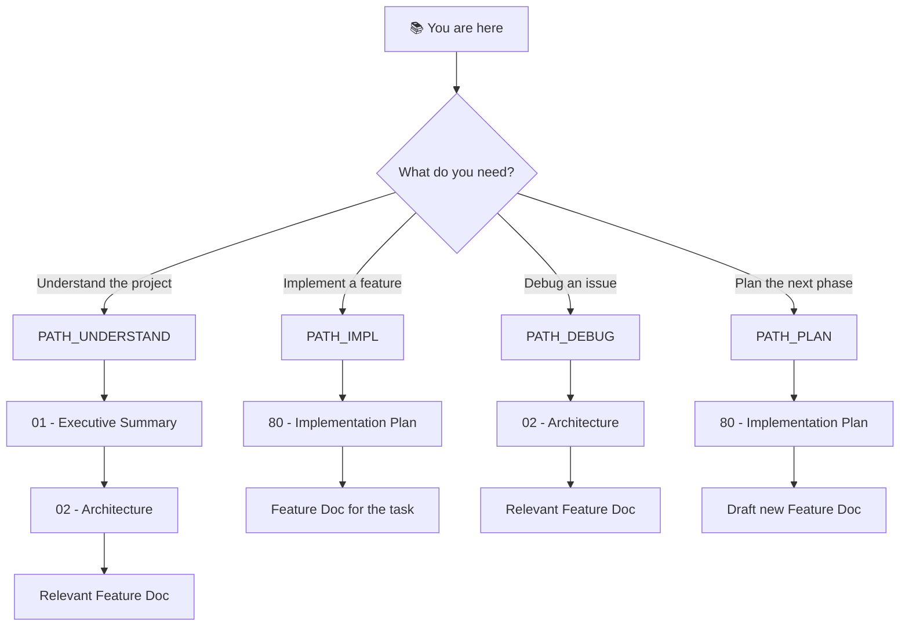

# 🎯 Warehouse Inventory System (WIS) Backend: Project Blueprint

> *A production-ready Spring Boot REST API that makes warehouse managers never again wonder "how much stock do we have and how did it get there?"*

**Document Type:** Technical Design Document / Project Blueprint  
**Version:** 1.0  
**Created:** 2026-03-09  
**Status:** 🚧 In Progress

---

## 📊 Progress Overview

| Phase | Status | Notes |
|-------|--------|-------|
| P0: Walking Skeleton | ✅ `[DONE]` | Products, Inventory, Transfers, CSV Import, Dashboard |
| P1: Auth + Pagination | ⏳ `[TODO]` | JWT auth + Pageable endpoints |
| P2: Audit Trail + Alerts | ⏳ `[TODO]` | Transfer audit log + Stock alert thresholds |
| P3: Reports + Caching | ⏳ `[TODO]` | PDF/Excel export + Redis caching |

### Status Legend

| Icon | Meaning |
|------|---------|
| ⏳ | TODO |
| 🔄 | WIP |
| ✅ | DONE |
| 🚧 | In Progress (phase) |
| 🚫 | CUT |

---

## 📐 Planning Standards

| Principle | Meaning |
|-----------|---------|
| **Walking Skeleton First** | Phase 0 proves HTTP → Service → DB pipeline (✅ already done) |
| **Difficulty Honesty** | Each item labeled `[KNOWN]`, `[EXPERIMENTAL]`, or `[RESEARCH]` |
| **Research ≠ Foundation** | `[RESEARCH]` items never in P0 |
| **Incremental Value** | Each phase delivers testable functionality |

---

## 📑 Document Index

| # | Document | Required | Purpose |
|---|----------|----------|---------|
| 00 | [Index](./00_index.md) | ✓ | **Navigation hub** — Start here |
| 01 | [Executive Summary](./01_executive_summary.md) | ✓ | **Vision & scope** — What/why |
| 02 | [Architecture](./02_architecture.md) | ✓ | **System design** — How pieces fit |
| 03 | [Feature: JWT Authentication](./03_feature_auth_jwt.md) | | **P1 feature** — Spring Security + JWT |
| 04 | [Feature: Pagination & Filtering](./04_feature_pagination.md) | | **P1 feature** — Pageable endpoints |
| 05 | [Feature: Audit Trail](./05_feature_audit_trail.md) | | **P2 feature** — Transfer history |
| 06 | [Feature: Stock Alerts](./06_feature_stock_alerts.md) | | **P2 feature** — Low stock notifications |
| 80 | [Implementation Plan](./80_implementation.md) | ✓ | **Task tracking** — Start/track work here |
| 99 | [References](./99_references.md) | | **External links** — Spring Boot docs |

---

## 💭 Vision Statement

> *"The WIS backend evolves from a functional MVP into a secure, observable, production-grade API — one phase at a time. Every change is reversible, every feature is testable, and the React frontend never breaks."*

---

## 🧭 Reading Order Decision Tree

