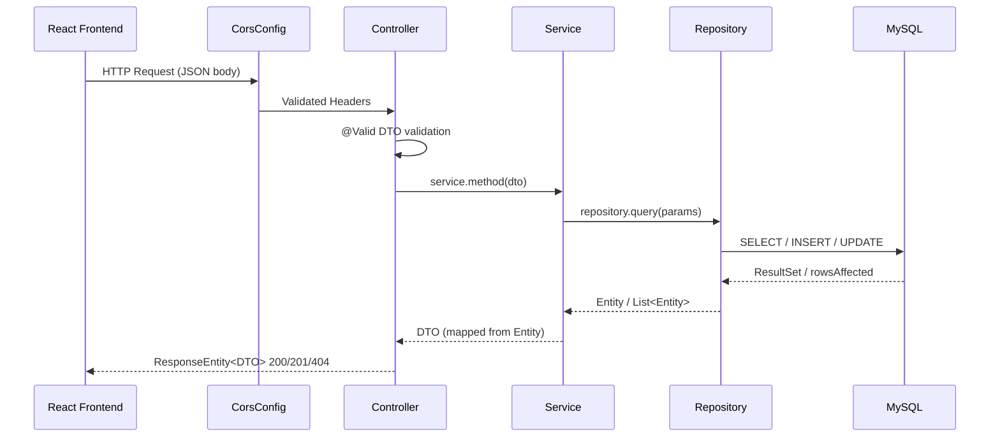
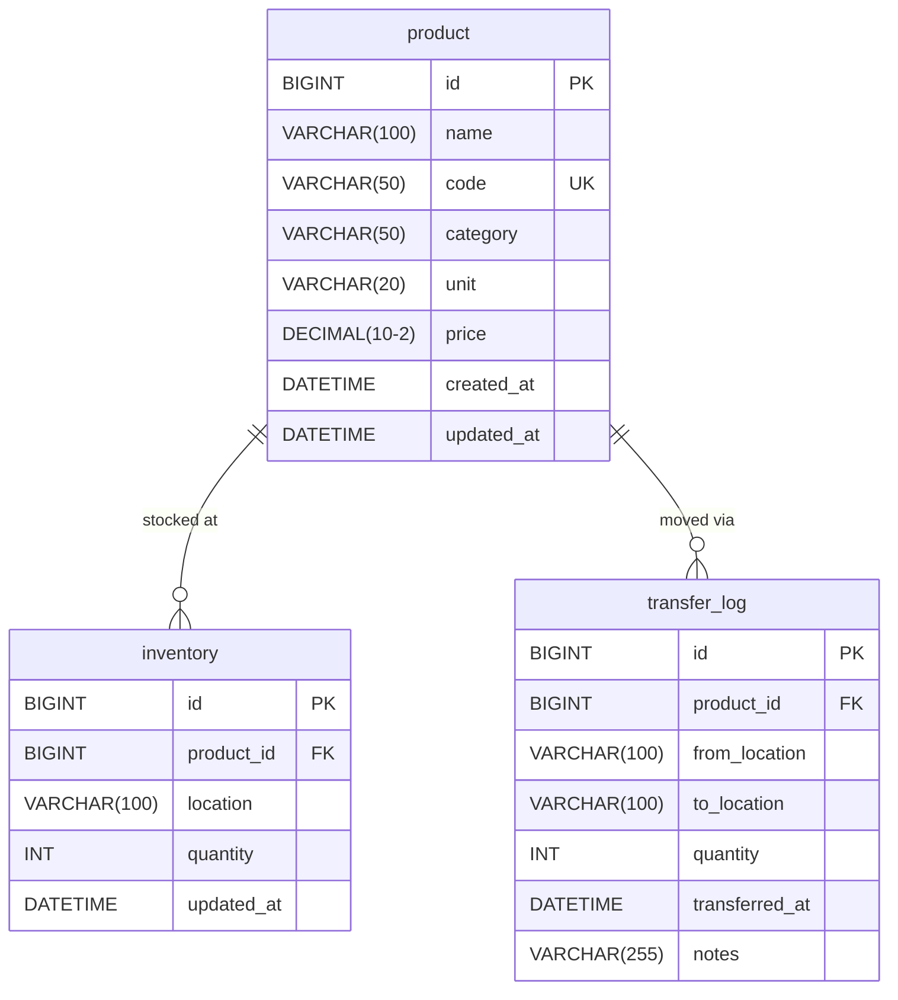
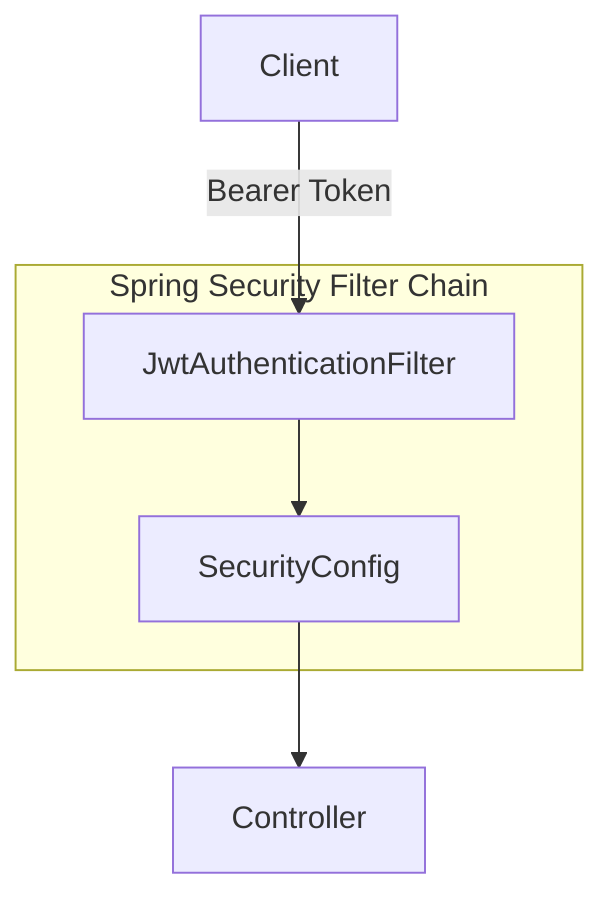

# 02 - Architecture

> Part of [WIS Backend Blueprint](./00_index.md)

---

## 🏗️ Current System Architecture

### High-Level Component Diagram

```mermaid
flowchart TB
    subgraph "Client Layer"
        FE[React Frontend\n:5173]
        SWAGGER[Swagger UI\n/swagger-ui.html]
    end

    subgraph "Spring Boot API: :8080"
        CORS[CorsConfig]
        CTRL[Controllers\n/api/**]
        SVC[Services\n@Transactional]
        REPO[Repositories\nJpaRepository]
        EXC[GlobalExceptionHandler\n@ControllerAdvice]
    end

    subgraph "Data Layer"
        DB[(MySQL 8.x\nwarehouse_db)]
    end

    FE -->|REST + JSON| CORS --> CTRL
    SWAGGER --> CTRL
    CTRL --> SVC --> REPO --> DB
    EXC -.->|handles errors| CTRL
```

---

## 📊 Request Lifecycle



---

## 🗂️ Layer Responsibilities

| Layer | Package | Responsibilities | Anti-Patterns |
|-------|---------|-----------------|---------------|
| **Controller** | `controller/` | Accept HTTP, validate, call service, return ResponseEntity | No business logic, no repo calls |
| **Service** | `service/` | Business logic, @Transactional, DTO ↔ Entity mapping | No direct HTTP types |
| **Repository** | `repository/` | Spring Data JPA query methods, custom @Query | No business logic |
| **Entity** | `entity/` | JPA mapping fields, must match schema.sql exactly | No business logic |
| **DTO** | `dto/` | Request/response shapes, Jakarta Validation | No JPA annotations |
| **Exception** | `exception/` | Custom exceptions + GlobalExceptionHandler | No catching runtime exceptions in controllers |

---

## 🗄️ Current Database Schema



---

## 🔧 Tech Stack

| Component | Technology | Version |
|-----------|----------|---------|
| Runtime | Java | 17+ |
| Framework | Spring Boot | 3.2.x |
| ORM | Spring Data JPA / Hibernate | 6.x |
| Database (prod) | MySQL | 8.x |
| Database (test) | H2 In-Memory | — |
| Build | Maven | 3.x |
| Boilerplate | Lombok | — |
| Testing | JUnit 5 + Mockito | — |
| CSV Import | OpenCSV | — |
| API Docs | Springdoc OpenAPI | — |

---

## 🔮 Planned Architecture Additions (Future Phases)

### P1: Security Layer (JWT)



| Addition | File | Phase |
|---------|------|-------|
| `SecurityConfig.java` | `config/` | P1 |
| `JwtAuthenticationFilter.java` | `security/` | P1 |
| `JwtUtil.java` | `security/` | P1 |
| `AuthController.java` | `controller/` | P1 |
| `UserEntity.java` + `users` table | `entity/` | P1 |

### P2: Audit Layer

| Addition | File | Phase |
|---------|------|-------|
| `TransferAuditLog.java` | `entity/` | P2 |
| `AuditService.java` | `service/` | P2 |

---

## ⚠️ Architecture Constraints (Non-Negotiable)

| Constraint | Enforcement |
|-----------|------------|
| No business logic in controllers | WarehouseSan BLOCKER |
| @Transactional on all multi-entity writes | WarehouseSan BLOCKER |
| Entity fields must match `schema.sql` columns | WarehouseSan BLOCKER |
| @Valid on all @RequestBody parameters | WarehouseSan WARNING |
| CORS configured for :5173 only | CorsConfig (do not break) |
